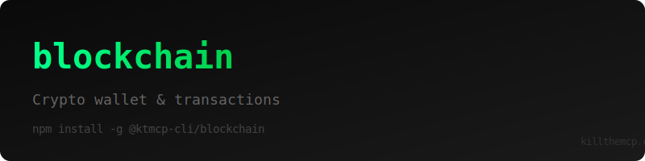

> "Six months ago, everyone was talking about MCPs. And I was like, screw MCPs. Every MCP would be better as a CLI."
>
> — [Peter Steinberger](https://twitter.com/steipete), Founder of OpenClaw
> [Watch on YouTube (~2:39:00)](https://www.youtube.com/@lexfridman) | [Lex Fridman Podcast #491](https://lexfridman.com/peter-steinberger/)

# Blockchain.com CLI

> **⚠️ Unofficial CLI** - Not officially sponsored or affiliated with Blockchain.com.

A production-ready command-line interface for [Blockchain.com](https://blockchain.com/) — manage crypto wallets, send transactions, check balances, and query blockchain data directly from your terminal.

## Features

- **Wallet Management** — Create and manage cryptocurrency wallets
- **Balance Checking** — Check Bitcoin and Ethereum balances
- **Transactions** — Send and receive cryptocurrency
- **Transaction History** — View transaction history and details
- **Address Management** — Generate and manage wallet addresses
- **Blockchain Explorer** — Query blockchain data and statistics
- **JSON output** — All commands support `--json` for scripting
- **Colorized output** — Clean terminal output with chalk

## Installation

```bash
npm install -g @ktmcp-cli/blockchain
```

## Quick Start

```bash
# Get an API key at https://blockchain.com
blockchain config set --api-key YOUR_API_KEY

# Check wallet balance
blockchain balance <address>

# Get transaction details
blockchain tx get <transaction-hash>

# List addresses in wallet
blockchain addresses list

# Get wallet info
blockchain wallet info
```

## Commands

### Config

```bash
blockchain config set --api-key <key>
blockchain config show
```

### Balance

```bash
blockchain balance <address>
blockchain balance <address> --json
blockchain balance multi <address1> <address2> <address3>
```

### Transactions

```bash
blockchain tx get <hash>
blockchain tx list
blockchain tx send --to <address> --amount <amount>
blockchain tx get <hash> --json
blockchain tx list --limit 50
```

### Addresses

```bash
blockchain addresses list
blockchain addresses generate
blockchain addresses get <address>
blockchain addresses list --json
```

### Wallet

```bash
blockchain wallet info
blockchain wallet balance
blockchain wallet new --label <label>
blockchain wallet info --json
```

### Blockchain Data

```bash
blockchain stats
blockchain block get <height>
blockchain block latest
blockchain stats --json
blockchain block get <height> --json
```

### Exchange Rates

```bash
blockchain rates
blockchain rates btc
blockchain rates eth
blockchain rates --json
```

## JSON Output

All commands support `--json` for structured output:

```bash
blockchain balance <address> --json | jq '.final_balance'
blockchain tx list --json | jq '.[] | select(.confirmations > 6)'
blockchain rates --json | jq '.USD.last'
```

## Why CLI > MCP?

No server to run. No protocol overhead. Just install and go.

- **Simpler** — Just a binary you call directly
- **Composable** — Pipe to `jq`, `grep`, `awk`
- **Scriptable** — Works in cron jobs, CI/CD, shell scripts

## License

MIT — Part of the [Kill The MCP](https://killthemcp.com) project.


---

## Support KTMCP

If you find this CLI useful, we'd greatly appreciate your support! Share your experience on:
- Reddit
- Twitter/X
- Hacker News

**Incentive:** Users who can demonstrate that their support/advocacy helped advance KTMCP will have their feature requests and issues prioritized.

Just be mindful - these are real accounts and real communities. Authentic mentions and genuine recommendations go a long way!

## Support This Project

If you find this CLI useful, we'd appreciate support across Reddit, Twitter, Hacker News, or Moltbook. Please be mindful - these are real community accounts. Contributors who can demonstrate their support helped advance KTMCP will have their PRs and feature requests prioritized.
